# Saner

Android marker-scanning assignment app built with React Native and Expo.

## Summary

Saner is an Android scanner for the Alemeno internship assignment. It captures a camera snapshot, isolates the marker area, normalizes the result to exactly `300x300`, validates the structure of the marker, and stores accepted captures inside the app.

- built with React Native and Expo
- targets Android native camera usage
- accepts the provided correct markers
- rejects the provided incorrect markers
- keeps up to 20 accepted marker results in-app

## Detailed Explanation

The scanner is designed around structure rather than center artwork recognition. The important idea is that a valid marker should have:

- a strong border
- a valid single corner anchor
- a normalized crop that can be scored consistently

To keep the code more human-readable, the scanner core was split into smaller files instead of leaving the whole implementation in one long analyzer file.

The detector currently uses:

- blob-first cropping to reduce background noise
- ring-based border detection for rotation tolerance
- corner-anchor analysis to distinguish valid anchors from incorrect dark blocks
- grayscale preview generation for debugging and visual validation

## Workflow

1. Open the camera preview.
2. Align the marker inside the guide frame.
3. Tap `Capture & Analyze`.
4. Capture a native snapshot.
5. Crop the guide area and tighten around the darkest marker blob.
6. Normalize the marker to `300x300`.
7. Run border and anchor validation.
8. If accepted, save the processed marker into the in-app gallery.

## Results

These reference cases are the practical validation baseline used while tuning the scanner.

| Case | Reference | Grayscale | Expected |
| --- | --- | --- | --- |
| Correct pig marker | 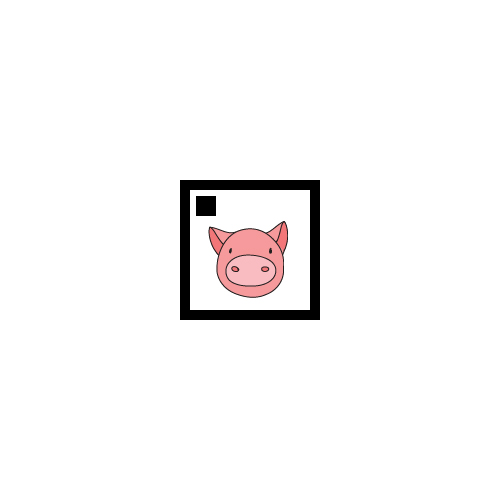 | 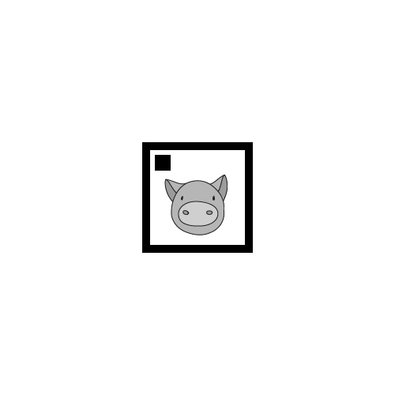 | Accepted, `Borders 4/4`, `Dark corners 1` |
| Correct dog marker | 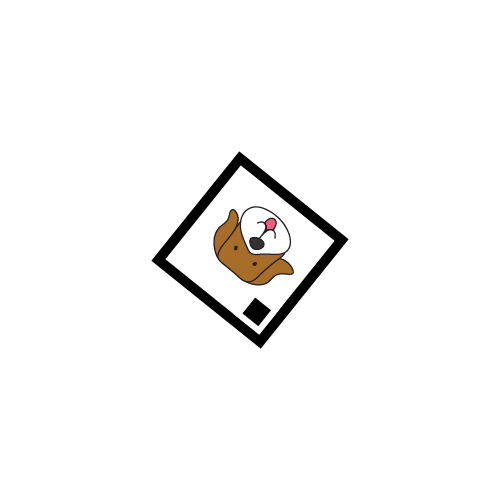 | 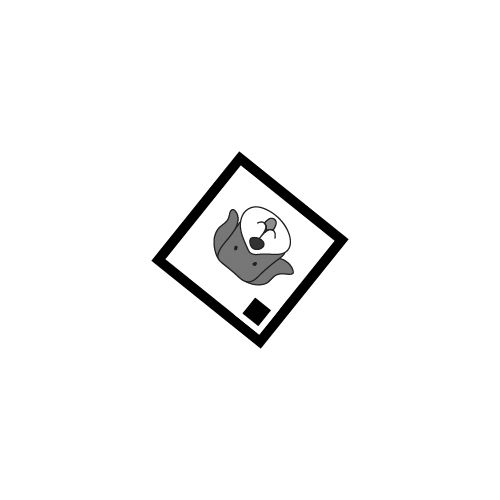 | Accepted, `Borders 4/4`, `Dark corners 1` |
| Rotated correct marker | 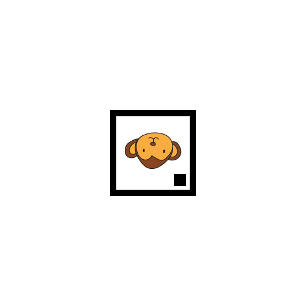 | 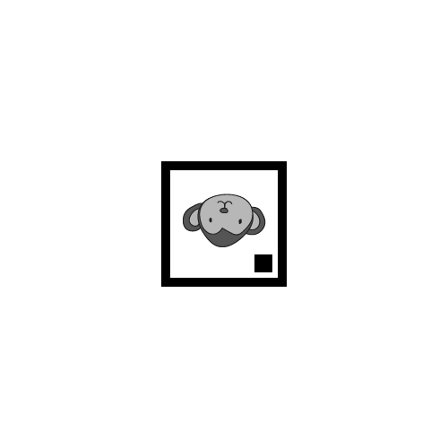 | Accepted despite rotation |
| Incorrect center-square marker | 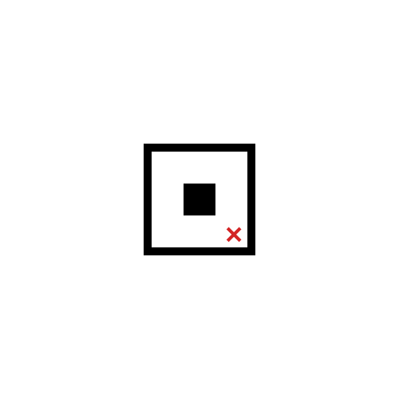 | 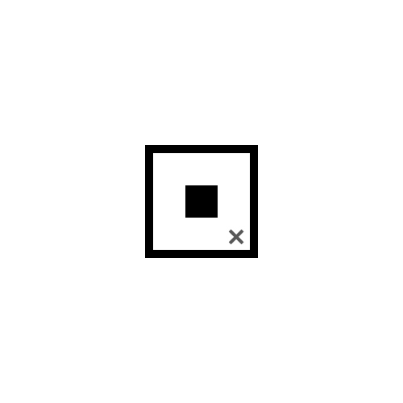 | Rejected, `No anchor corner found` |
| Incorrect oversized-anchor marker | 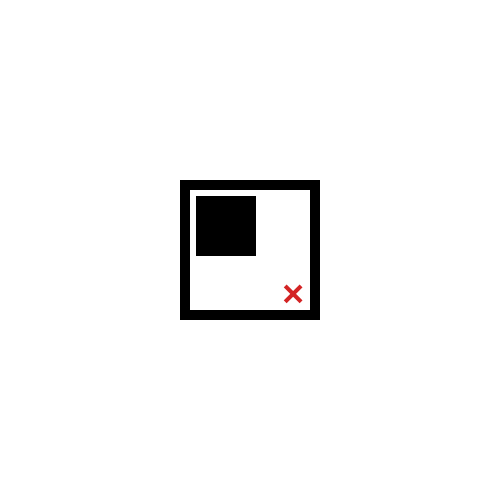 | 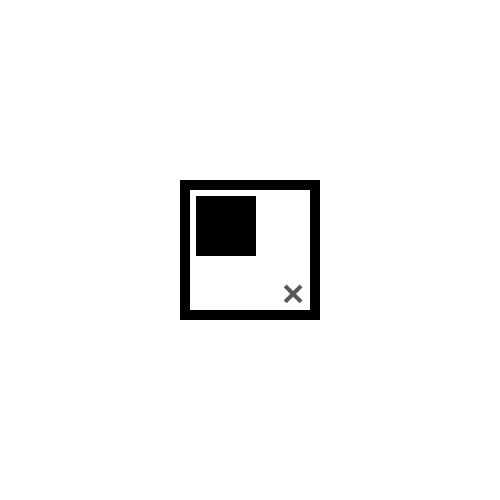 | Rejected, `Anchor square is oversized` |

The grayscale images are included because the detector is designed to rely mainly on shape, border persistence, and anchor placement rather than on full original color.

## Final Device Testing Screenshots

Additional screenshots from final device testing and extra object-check runs are stored in:

`assets/submission-screenshots`

| 1 | 2 | 3 |
| --- | --- | --- |
| 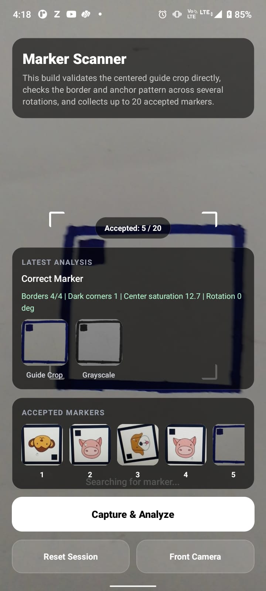 | 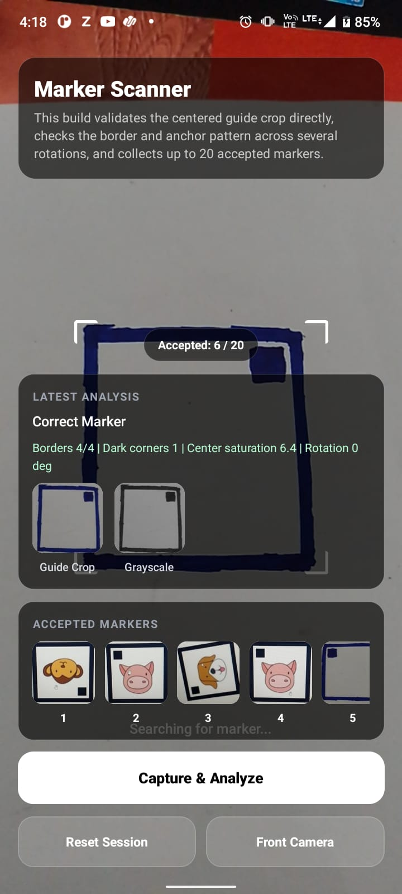 | 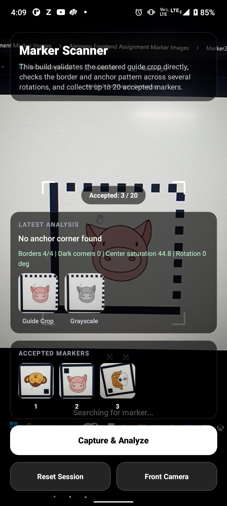 |
| 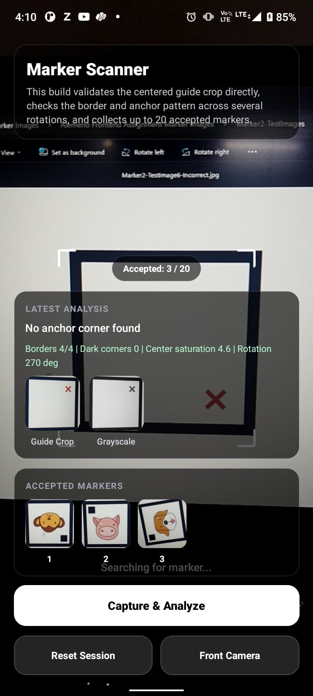 | 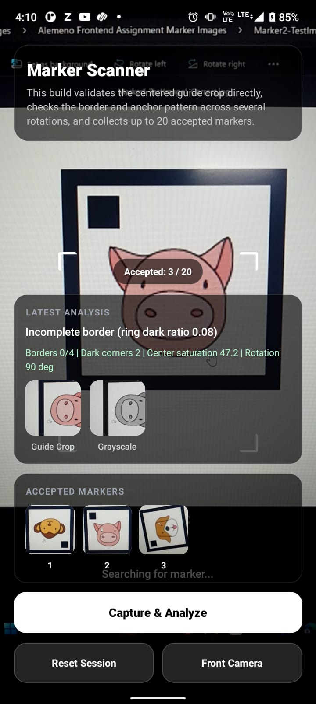 | 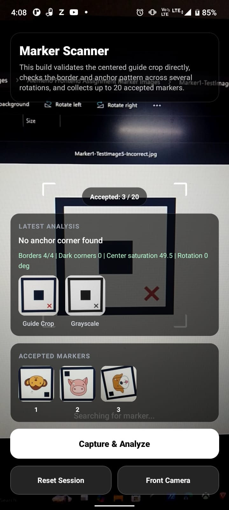 |
| 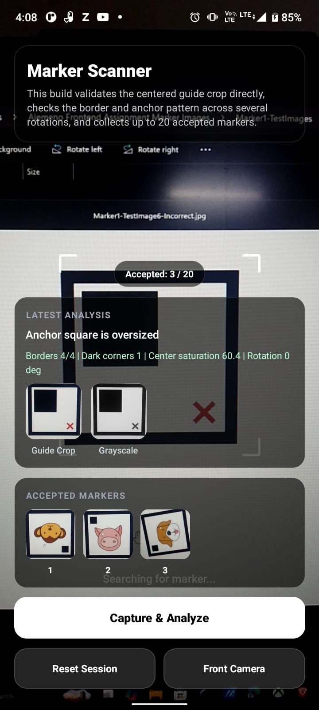 | 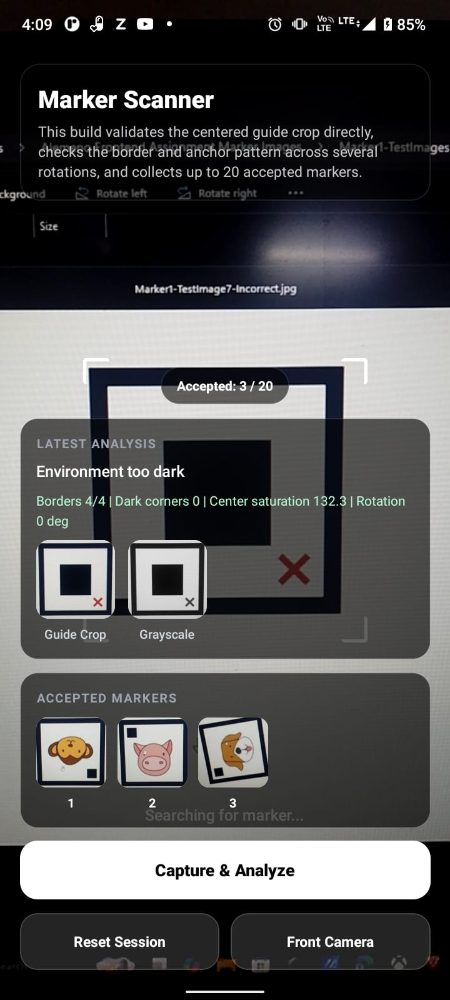 | 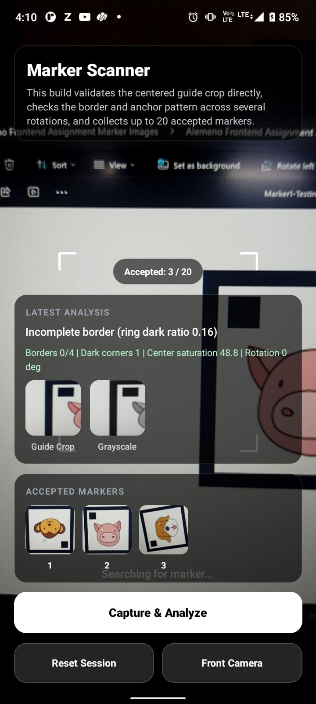 |
| 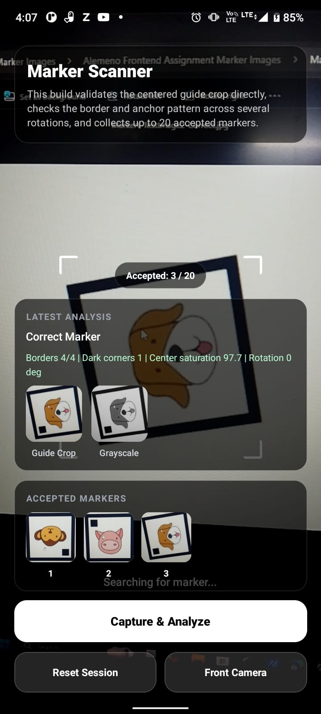 | 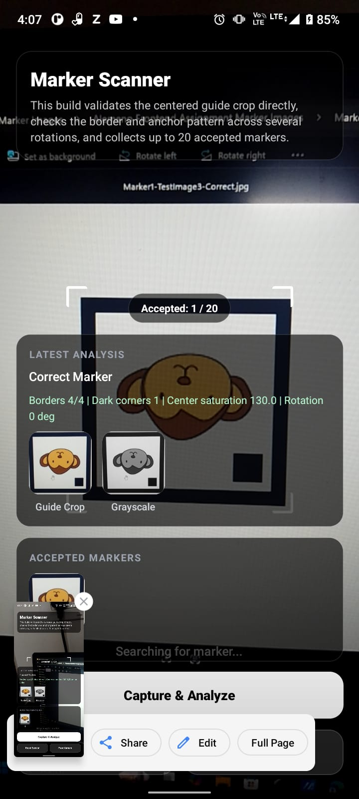 | 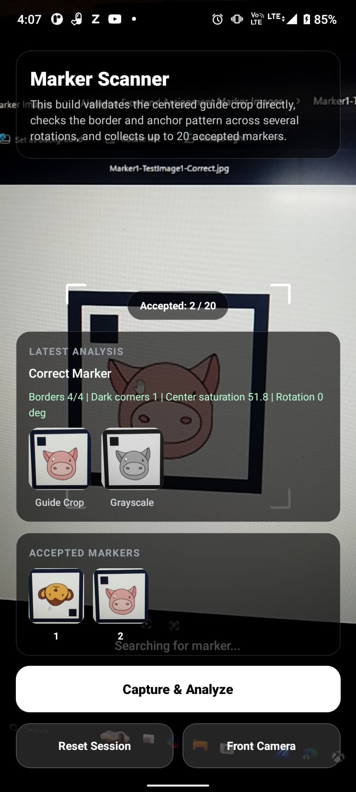 |

## Achievements

- created a working Android scanner app
- built a scanner pipeline that produces exact `300x300` outputs
- added a release APK build for device installation
- refactored the scanner into smaller files for readability
- documented a reference baseline using original and grayscale marker images

## Main Files

- `app/camera.tsx`: camera screen, capture flow, gallery, debug metrics
- `app/marker-debug.tsx`: sample-image debug screen
- `src/features/scanner/analyzeCapturedMarker.ts`: public scanner API
- `src/features/scanner/markerAnalyzerCore.ts`: blob crop, normalized analysis, scoring
- `src/features/scanner/markerPixelUtils.ts`: low-level pixel sampling helpers
- `src/features/scanner/markerPreview.ts`: grayscale debug preview generation
- `src/features/scanner/markerAnalysis.types.ts`: scanner types and constants

## Run locally

```bash
npm install
npx expo run:android
```

## Build APK

Debug APK:

```bash
cd android
gradlew assembleDebug
```

Release APK:

```bash
cd android
gradlew assembleRelease
```

The release APK is generated at:

`android/app/build/outputs/apk/release/app-release.apk`

## Notes

- the current scanner is snapshot-based, not a continuous frame-processor detector
- the processed output size is fixed to `300x300` to match the assignment requirement
- camera format selection prefers roughly `2560x2560` and aims to stay inside the required `2000-3000` range
